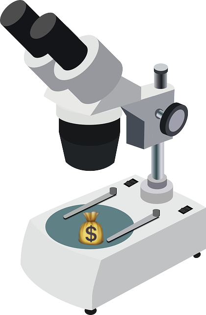

<p align="center">
  
</p>

# MicroCash

[Cash]((https://github.com/kenwheeler/cash) is an absurdly small jQuery alternative for modern browsers (IE10+) that provides jQuery-style syntax for manipulating the DOM. 100% feature parity with jQuery isn't a goal, but Cash comes helpfully close, covering most day to day use cases. MicroCash takes this a step farther - knocking another 30% off the file size of Cash. MicroCash does this by being super opinionated and ignoring parity with jQuery to focus entirely on core usability to developers and providing the smallest possible bundle size.

## Comparison

| Size               |    MicroCash  | Cash     | Zepto 1.2.0 | jQuery 3.3.1 |
| ------------------ | ------------- | -------- | ----------- | ------------ |
| Uncompressed       |  **26 KB**    |  32 KB   | 58.7 KB     | 271 KB       |
| Minified           |  **10 KB**    |  14.5 KB | 26 KB       | 87 KB        |
| Minified & Gzipped |  **3.8 KB**   |  5 KB    | 9.8 KB      | 30.3 KB      |

A **90%** gain in size reduction compared to jQuery. If you need a smaller bundle, you may have to rewrite Cash - most of the remaining functions depend on each other. Everything else is already gone...

| Features                 | Cash (& MicroCash)           | Zepto 1.2.0                    | jQuery 3.3.1             |
| ------------------------ | ---------------------------- | ------------------------------ | ------------------------ |
| Supports Modern Browsers | ✔                            | ️✔                              | ✔                        |
| Actively Maintained      | ✔                            | ❌                             | ✔                        |
| Namespaced Events        | ✔                            | ️❌                             | ✔                        |
| Modern Codebase          | ✔ (TypeScript)               | ❌                              | ❌                        |
| TypeScript Types         | ✔ (generated from code)      | ⚠️ (via DefinitelyTyped)        | ⚠️ (via DefinitelyTyped) |
| Partial Builds           | ✔ (can exclude single files) | ⚠️ (can exclude whole modules)  | ❌                        |

If you're migrating from jQuery be sure to read the [migration guide](https://github.com/swissarmybud/MicroCash/blob/master/docs/migration_guide.md).

## Usage

Download this repo, run `npm install` then run `npm run build:prod` in the root folder - and get your minimized bundle from the `/dist` folder.

## Documentation

MicroCash gives you a query selector, [collection methods](#collection-methods) and some [library methods](#cash-methods). MicroCash can be extended with custom methods, read how [here](https://github.com/swissarmybud/MicroCash/blob/master/docs/extending_cash.md).

### $()

This is the main selector method for Cash. It returns an actionable collection of nodes.

If a function is provided, the function will be run once the DOM is ready.

```js
$( selector [, element] ) // => collection, using `element` as the context
$( selector [, collection] ) // => collection, using `collection` as the context
$(node) // => collection
$(nodeList) // => collection
$(htmlString) // => collection
$(collection) // => self
$(function () {}) // => document ready callback
```

### Collection Methods

These methods from the collection prototype ([$.fn](#fn)) are available once you create a collection with `$()` and are called like so:

```js
$(element).addClass ( className ) // => collection
```

A large number of additional functions are available in regular Cash, but [disabled](https://github.com/swissarmybud/MicroCash/blob/master/pacco.json#L3) in MicroCash. That's the whole point - but they can be enabled if desired.

| Attributes                           | Collection                 | CSS                  | Effects                    |
| ------------------------------------ | -------------------------- | -------------------- | -------------------------- |
| [fn.addClass ()](#fnaddclass-)       | [fn.add ()](#fnadd-)       | [fn.css ()](#fncss-) | [fn.hide ()](#fnhide-)     |
| [fn.attr ()](#fnattr-)               | [fn.each ()](#fneach-)     |                      | [fn.show ()](#fnshow-)     |
| [fn.hasClass ()](#fnhasclass-)       | [fn.filter ()](#fnfilter-) |                      | [fn.toggle ()](#fntoggle-) |
| [fn.removeAttr ()](#fnremoveattr-)   | [fn.get ()](#fnget-)       |                      |                            |
| [fn.removeClass ()](#fnremoveclass-) | [fn.slice ()](#fnslice-)   |                      |                            |
| [fn.toggleClass ()](#fntoggleclass-) |                            |                      |                            |


| Events                       | Forms                            | Manipulation                           | Traversal                      |
| ---------------------------- | -------------------------------- | -------------------------------------- | ------------------------------ |
| [fn.off ()](#fnoff-)         | [fn.serialize ()](#fnserialize-) | [fn.after ()](#fnafter-)               | [fn.children ()](#fnchildren-) |
| [fn.on ()](#fnon-)           | [fn.val ()](#fnval-)             | [fn.appendTo ()](#fnappendto-)         | [fn.find ()](#fnfind-)         |
| [fn.ready ()](#fnready-)     |                                  | [fn.before ()](#fnbefore-)             | [fn.has ()](#fnhas-)           |
| [fn.trigger ()](#fntrigger-) |                                  | [fn.detach ()](#fndetach-)             | [fn.is ()](#fnis-)             |
|                              |                                  | [fn.empty ()](#fnempty-)               | [fn.next ()](#fnnext-)         |
|                              |                                  | [fn.html ()](#fnhtml-)                 | [fn.not ()](#fnnot-)           |
|                              |                                  | [fn.insertAfter ()](#fninsertafter-)   | [fn.parent ()](#fnparent-)     |
|                              |                                  | [fn.insertBefore ()](#fninsertbefore-) | [fn.prev ()](#fnprev-)         |
|                              |                                  | [fn.prependTo ()](#fnprependto-)       | [fn.siblings ()](#fnsiblings-) |
|                              |                                  | [fn.remove ()](#fnremove-)             |                                |                                |
|                              |                                  | [fn.replaceWith ()](#fnreplacewith-)   |                                |                                |
|                              |                                  | [fn.text ()](#fntext-)                 |                                |                                |


#### $.fn

The main prototype for collections, allowing you to extend Cash with plugins by adding methods to all collections.

```js
$.fn // => Cash.prototype
$.fn.myMethod = function () {}; // Custom method added to all collections
$.fn.extend ( object ); // Add multiple methods to the prototype
```

#### fn.add ()

Returns a new collection with the element(s) added to the end.

```js
$(element).add ( element ) // => collection
$(element).add ( selector ) // => collection
$(element).add ( collection ) // => collection
```

#### fn.addClass ()

Adds the `className` class to each element in the collection.

Accepts space-separated `className` for adding multiple classes.

```js
$(element).addClass ( className ) // => collection
```

#### fn.after ()

Inserts content or elements after the collection.

```js
$(element).after ( element ) // => collection
$(element).after ( htmlString ) // => collection
$(element).after ( content [, content] ) // => collection
```

#### fn.appendTo ()

Adds the elements in the collection to the target element(s).

```js
$(element).appendTo ( element ) // => collection
```

#### fn.attr ()

Without `attrValue`, returns the attribute value of the first element in the collection.

With `attrValue`, sets the attribute value of each element of the collection.

```js
$(element).attr ( attrName ) // value
$(element).attr ( attrName, attrValue ) // => collection
$(element).attr ( object ) // => collection
```

#### fn.before ()

Inserts content or elements before the collection.

```js
$(element).before ( element ) // => collection
$(element).before ( htmlString ) // => collection
$(element).before ( content [, content] ) // => collection
```

#### fn.children ()

Without a selector specified, returns a collection of child elements.

With a selector, returns child elements that match the selector.

```js
$(element).children () // => collection
$(element).children ( selector ) // => collection
```

#### fn.css ()

Returns a CSS property value when just property is supplied.

Sets a CSS property when property and value are supplied.

Sets multiple properties when an object is supplied.

Properties will be autoprefixed if needed for the user's browser.

```js
$(element).css ( property ) // => value
$(element).css ( property, value ) // => collection
$(element).css ( object ) // => collection
```

#### fn.each ()

Iterates over a collection with `callback ( index, element )`.

```js
$(element).each ( callback ) // => collection
```

#### fn.empty ()

Empties the elements interior markup.

```js
$(element).empty () // => collection
```

#### fn.filter ()

Returns the collection that results from applying the filter selector/method.

```js
$(element).filter ( selector ) // => collection
$(element).filter ( function ( index, element ) {} ) // => collection
```

#### fn.get ()

Returns the element at the index, or returns all elements.

```js
$(element).get ( index ) // => domNode
$(element).get () // => domNode[]
```

#### fn.has ()

Reduce the set of matched elements to those that have a descendant that matches the selector or DOM element.

```js
$(element).has ( selector ) // => collection
$(element).has ( element ) // => collection
```

#### fn.hasClass ()

Returns the boolean result of checking if any element in the collection has the `className` attribute.

```js
$(element).hasClass ( className ) // => boolean
```

#### fn.hide ()

Hide the elements.

```js
$(element).hide () // => collection
```

#### fn.html ()

Returns the HTML text of the first element in the collection, sets the HTML if provided.

```js
$(element).html () // => HTML Text
$(element).html ( htmlString ) // => HTML Text
```

#### fn.insertAfter ()

Inserts collection after specified element.

```js
$(element).insertAfter ( element ) // => collection
```

#### fn.insertBefore ()

Inserts collection before specified element.

```js
$(element).insertBefore ( element ) // => collection
```

#### fn.is ()

Returns whether the provided selector, element or collection matches any element in the collection.

```js
$(element).is ( selector ) // => boolean
```

#### fn.next ()

Returns the next adjacent elements.

```js
$(element).next () // => collection
$(element).next ( selector ) // => collection
```

#### fn.not ()

Filters collection by false match on collection/selector.

```js
$(element).not ( selector ) // => collection
$(element).not ( collection ) // => collection
```

#### fn.off ()

Removes event listener from collection elements.

Accepts space-separated `eventName` for removing multiple events listeners.

Removes all event listeners if called without arguments.

```js
$(element).off ( eventName, eventHandler ) // => collection
$(element).off ( eventName ) // => collection
$(element).off () // => collection
```

#### fn.on ()

Adds event listener to collection elements.

Accepts space-separated `eventName` for listening to multiple events.

Event is delegated if delegate is supplied.

```js
$(element).on ( eventName, eventHandler ) // => collection
$(element).on ( eventName, delegate, eventHandler ) // => collection
```

#### fn.parent ()

Returns collection of elements who are parent of elements.

```js
$(element).parent () // => collection
$(element).parent ( selector ) // => collection
```

#### fn.prependTo ()

Prepends elements in a collection to the target element(s).

```js
$(element).prependTo ( element ) // => collection
```

#### fn.prev ()

Returns the previous adjacent elements.

```js
$(element).prev () // => collection
$(element).prev ( selector ) // => collection
```

#### fn.ready ()

Calls callback method on DOMContentLoaded.

```js
$(document).ready ( callback ) // => collection/span
```

#### fn.remove ()

Removes collection elements from the DOM and removes all their event listeners.

```js
$(element).remove () // => collection
```

#### fn.replaceWith ()

Replace collection elements with the provided new content.

```js
$(element).replaceWith ( content ) // => collection
```

#### fn.removeAttr ()

Removes attribute from collection elements.

Accepts space-separated attrName for removing multiple attributes.

```js
$(element).removeAttr ( attrName ) // => collection
```

#### fn.removeClass ()

Removes className from collection elements.

Accepts space-separated className for adding multiple classes.

Providing no arguments will remove all classes.

```js
$(element).removeClass () // => collection
$(element).removeClass ( className ) // => collection
```

#### fn.serialize ()

When called on a form, serializes and returns form data.

```js
$(form).serialize () // => String
```

#### fn.show ()

Show the elements.

```js
$(element).show () // => collection
```

#### fn.siblings ()

Returns a collection of sibling elements.

```js
$(element).siblings () // => collection
$(element).siblings ( selector ) // => collection
```

#### fn.slice ()

Returns a new collection with elements taken from start to end.

```js
$(selector).slice ( start, end ) // => collection
```

#### fn.text ()

Returns the inner text of the first element in the collection, sets the text if textContent is provided.

```js
$(element).text () // => text
$(element).text ( textContent ) // => collection
```

#### fn.toggle ()

Hide or show the elements.

```js
$(element).toggle () // => collection
```

#### fn.toggleClass ()

Adds or removes className from collection elements based on if the element already has the class.

Accepts space-separated classNames for toggling multiple classes, and an optional `force` boolean to ensure classes are added (`true`) or removed (`false`).

```js
$(element).toggleClass ( className ) // => collection
$(element).toggleClass ( className, force ) // => collection
```

#### fn.trigger ()

Triggers supplied event on elements in collection. Data can be passed along as the second parameter.

```js
$(element).trigger ( eventName ) // => collection
$(element).trigger ( eventObj ) // => collection
$(element).trigger ( eventName, data ) // => collection
$(element).trigger ( eventObj, data ) // => collection
```


#### fn.val ()

Returns an inputs value. If value is supplied, sets all inputs in collection's value to the value argument.

```js
$(input).val () // => value
$(input).val ( value ) // => collection
```

### Cash Methods

These methods are exported from the global `$` object, and are called like so:

```js
$.isString ( str ) // => boolean
```

Some [extra methods](https://github.com/kenwheeler/cash/tree/master/src/extra) are available but [disabled](https://github.com/kenwheeler/cash/blob/master/pacco.json#L3) by default.

| Type Checking                   | Utilities                           |
| ------------------------------- | ----------------------------------- |
| [$.isArray ()](#isarray-)       | [$.guid](#guid)                     |
| [$.isFunction ()](#isfunction-) | [$.camelCase ()](#camelcase-)       |
| [$.isNumeric ()](#isnumeric-)   | [$.each ()](#each-)                 |
| [$.isString ()](#isstring-)     | [$.matches ()](#matches-)           |
| [$.isWindow ()](#iswindow-)     | [$.parseHTML ()](#parsehtml-)       |
|                                 | [$.prefixedProp ()](#prefixedprop-) |
|                                 | [$.unique ()](#unique-)             |


#### $.guid

A unique number.

```js
$.guid++ // => number
```

#### $.camelCase ()

Transforms a string to camelCase.

```js
$.camelCase ( 'border-width' ) // => 'borderWidth'
```

#### $.each ()

Iterates through an array and calls the `callback ( value, index, array )` method on each.

```js
$.each ( array, callback ) // => undefined
```

#### $.isArray ()

Check if the argument is an array.

```js
$.isArray ([ 1, 2, 3 ]) // => true
```

#### $.isFunction ()

Check if the argument is a function.

```js
function fn () {};
$.isFunction ( fn ) // => true
```

#### $.isNumeric ()

Check if the argument is numeric.

```js
$.isNumeric ( 57 ) // => true
```

#### $.isString ()

Check if the argument is a string.

```js
$.isString ( 'hello' ) // => true
```

#### $.isWindow ()

Check if the argument is a Window object.

```js
$.isWindow ( window ) // => true
```

#### $.matches ()

Checks a selector against an element, returning a boolean value for match.

```js
$.matches ( element, selector ) // => boolean
```

#### $.parseHTML ()

Returns a collection from an HTML string.

```js
$.parseHTML ( htmlString ) // => collection
```

#### $.prefixedProp ()

Return a prefixed CSS property, if necessary.

```js
$.prefixedProp ( 'transform' ) // => 'mozTransform'
```

#### $.unique ()

Returns a new array with duplicates removed.

```js
$.unique ( array ) // => array
```

## Contributing

If you found a problem, or have a feature request, please open an [issue](https://github.com/swissarmybud/MicroCash/issues) about it.

If you want to make a pull request you should:

1. Clone the repository: `git clone https://github.com/swissarmybud/MicroCash.git microcash`.
2. Enter the cloned repository: `cd microcash`
3. Install the dependencies: `npm install`.
4. Automatically recompile Cash whenever a change is made: `npm run dev`.
5. Automatically rerun the tests whenever a change is made: `npm run test:watch`.
6. Remember to update the readme, if necessary.

## Thanks

- **[@hisk](https://github.com/hisk)** - The "design focused engineer" behind our awesome logo.
- **[Sauce Labs](https://saucelabs.com)** - The cross-browser testing platform we use for testing our builds in all the supported environments.
- **[Ken Wheeler](https://github.com/kenwheeler)** - The original author of Cash.js (includig most of this README)
## License

MIT © Ken Wheeler, changes same - Andrew Porter
